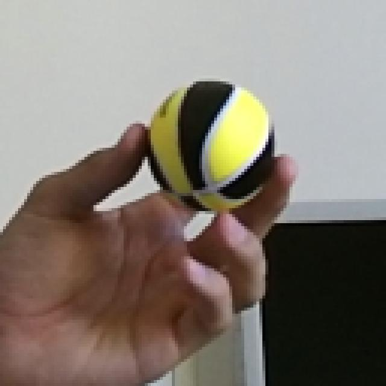

# handheld-recognition

Problem Statement: To detect from images if a hand is holding onto any household objects 

There are two parts in the project,
1. Hand and object detection using yolov5s (by fine-tuning a pretrained model with hands, objects and combinational)
2. Classifying action as hand held object or not by using metrics returned by yolov5

Procedure:

1. Data

    - Used roboflow to build dataset from different collections. The image data comprises of 3 variations: 1. Hands, 2. Household Objects and 3. Hands holding objects.
    - Curation also includes around 50 custom images captured of hand and objects
    - Link to dataset curated, https://app.roboflow.com/dsprojects-1ey6h/hand-object-grasp/6
        - Training: 620
        - Valid: 68
        - Test: 62
    (These sets includes augmented images. Augmentations used are 90 deg rotate, shear, noise, slight rotations)
    - Each image will have its own label file with coordinates for the hand/object annotated location.

    | Sample image 1 | Sample image 2 
    |---------|---------|
    |  |  |

2. Model and training

    - A yolov5s (small) fine tuned over custom dataset
    - A lightweight considered for low computing edge device deployments
    - Training part is commented, run accordingly. (Skip if performing inference only)

3. Inference/Detections

    1. A yolov5 model fine tuned with custom dataset returns hand and object detections with confidence metrics
    2. Utilizing confidence metrics and iou scores to classify the image as 'hand grasp object' or 'no grasp'

4. Visualizing results

| Hand grasp object (iou = 0.18) | No grasp (iou = 0) 
|---------|---------|
|  |  |

Note: intersection over union (iou) - the ratio of the intersection of the two boxes areas to their combined areas. If iou > 0.1, then action labelled as 'Hand grasp object' else 'No grasp'

5. References

- [YOLOv5 GitHub Repository](https://github.com/ultralytics/yolov5)  
- [Roboflow](https://roboflow.com)  